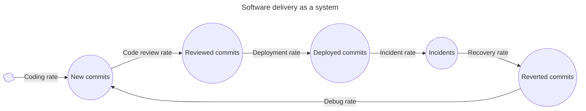

+++
title = 'Release value early and often'
date = 2025-10-25T11:09:44+02:00
draft = true
tags = ['Technical Excellence', 'Productivity']
summary = 'Learnings from leading an organization to continuous delivery.'
+++

_Figure 1. Software delivery as a system (source: [Lethain](https://lethain.com/systems-thinking/))._