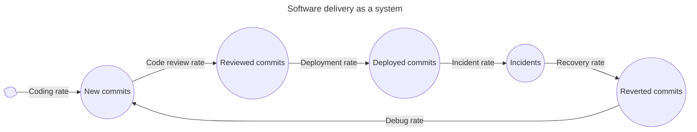

+++
title = 'Release value early and often'
date = 2025-10-25T11:09:44+02:00
draft = true
tags = ['Technical Excellence', 'Productivity']
summary = 'Learnings from implementing continuous delivery.'
+++

## Problem

- Issues: slow delivery, especially in highly collaborative code bases with many engineers, so much waste (resolving merge conflicts between long lived branches, many steps in the release process with no purpose / value only transport from one state/branch to another, only contributing to higher risk and low confidence and quality as the complicated process forced batches to always be large since changes kept piling up - there was no way to get a small change out the door quickly → forcing more QA to manage risk → developers/people spending time on non-valuable work → complicated hotfix/mitigation → less time coding → …)

_Figure 1. Software delivery as a system (source: [Lethain](https://lethain.com/systems-thinking/))._

## Outcomes

- 10% increase deployment frequency (weekly -> daily releases in core services)
- 30% reduction in change failure rate
- 50% increase in developer experience related to the release process

## Learnings

- It works incredibly well and people get excited once they experience it
- People struggle to see it in the beginning
- Requires air cover from senior leadership
- Define it clearly and have a way to measure progress (ideally by repository) - TBD by default branch, etc (define metrics per practices - https://minimumcd.org/)
- Very important to define the WHAT and keep reiterating it because the term is ambiguous and everyone has their own interpretation. TBD, continuous integration, continuous delivery, continuous deployment, etc.
- It’s complicated and takes a long time to - hence it’s essential to communicate progress and wins to maintain trust
- Pull data from your VCS
- Ephemeral environments important step for QA and keeping feedback loop short
- Dare to be bold - deploy every commit → forces the right behaviors (eg cautious -> adding more tests) and every release is by default tiny → safer